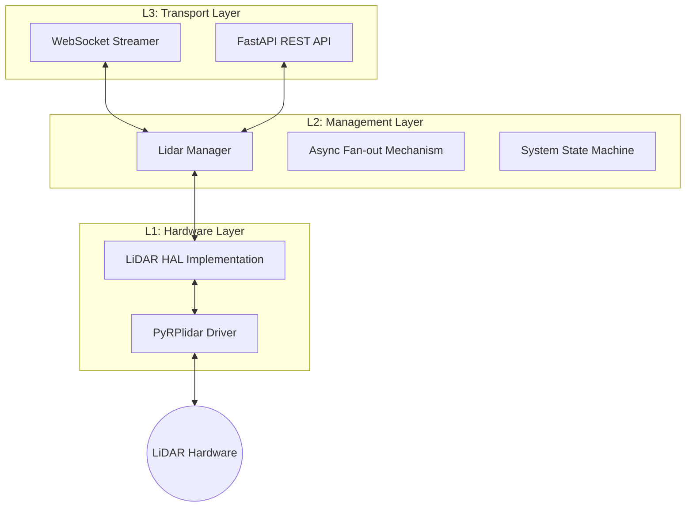

# LiDAR Middleware HAL Service

A high-performance, asynchronous middleware service designed to provide a standardized **Hardware Abstraction Layer (HAL)** for LiDAR sensors. This service abstracts complex serial communication into a clean **REST API** for control and a high-frequency **WebSocket** stream for real-time data visualization and processing.

## Project description
* **Hardware Agnostic**: Create a unified HAL that can support various LiDAR models (starting with RPLIDAR C1).
* **Decoupled Architecture**: Separate physical hardware constraints from data consumption.
* **Real-time Streaming**: Optimized for low-latency tools like **TouchDesigner**, **Unity**, or **ROS**.
* **Async-First**: Built on `FastAPI` and `asyncio` to handle multiple concurrent subscribers without blocking the main hardware thread.

---

## System Architecture

The service is built using a strict three-layer pattern to ensure that logic, transport, and hardware remains decoupled.

