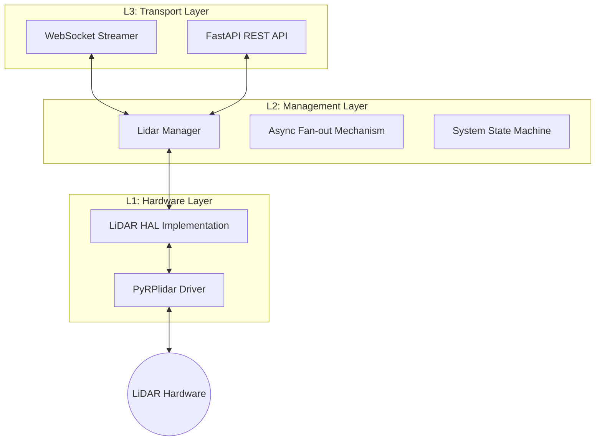
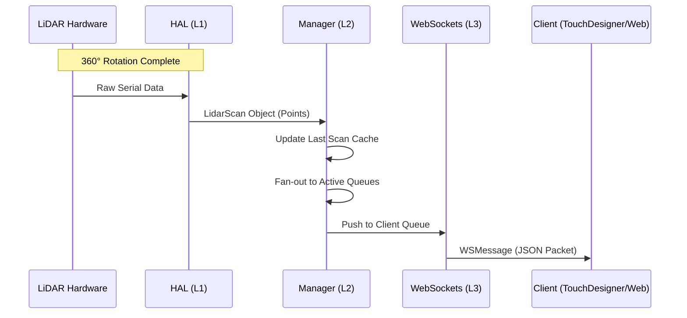

# LiDAR Middleware HAL Service

A high-performance, asynchronous middleware service designed to provide a standardized **Hardware Abstraction Layer (
HAL)** for LiDAR sensors. This service abstracts complex serial communication into a clean **REST API** for control and
a high-frequency **WebSocket** stream for real-time data visualization and processing.

## Project description

* **Hardware Agnostic**: Create a unified HAL that can support various LiDAR models (starting with RPLIDAR C1).
* **Decoupled Architecture**: Separate physical hardware constraints from data consumption.
* **Real-time Streaming**: Optimized for low-latency tools like **TouchDesigner**, **Unity**, or **ROS**.
* **Async-First**: Built on `FastAPI` and `asyncio` to handle multiple concurrent subscribers without blocking the main
  hardware thread.

---

## System Architecture

The service is built using a strict three-layer pattern to ensure that logic, transport, and hardware remains decoupled.



## Data Flow Sequence

The following diagram illustrates how a single rotation of the LiDAR is processed and delivered to multiple clients
simultaneously:



## Getting Started

### Installation

The service is packaged using `pyproject.toml` for modern Python environments.

```bash
# Clone the repository
git clone https://github.com/heycarl/lidar-hal-service.git
cd lidar-hal-service

# Install the package and dependencies
pip install .
```

## API & Integration

### REST API (Control Plane)

The service automatically generates interactive documentation. Once the service is running, it is available at:

* **Swagger UI**: `http://localhost:8000/docs`
* **Redoc**: `http://localhost:8000/redoc`

**Key Endpoints:**

* `GET /status`: Retrieve hardware state, active configuration, and the number of connected subscribers.
* `POST /start`: Initiates motor spin-up, waits for RPM stabilization, and begins the scanning thread.
* `POST /stop`: Safely powers down the motor and terminates acquisition threads.
* `PUT /config`: Update PWM or Serial port parameters on the fly (triggers a safe restart sequence).
* `GET /scan/latest`: Retrieves the most recent completed 360° scan (snapshot).

### WebSocket (Data Plane)

For high-frequency, real-time data streaming, use the dedicated WebSocket endpoint:

* **URL**: `ws://[IP_ADDR]:8000/ws/scan`

**Protocol Specification:**
Data is delivered in JSON format. Every message is wrapped in an "envelope" with a `type` field, allowing clients (e.g.,
TouchDesigner or JavaScript) to route different message types efficiently.

```json
{
  "type": "lidar_scan",
  "data": {
    "timestamp": 1704300000.123,
    "points": [
      {"angle": 0.0, "distance": 1200.5, "intensity": 47},
      {"angle": 0.8, "distance": 1205.2, "intensity": 50}
    ]
  }
}